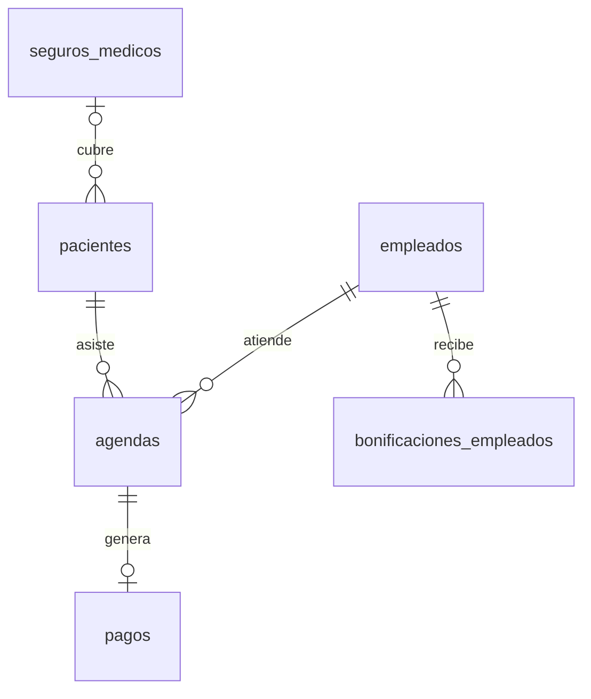

# Plan de Implementación: Base de Datos de Servicios de Psicología y Datos Sintéticos

Este plan detalla el diseño y la creación de una base de datos SQLite (`consultorio_psicologia.db`) que simula la operación de un centro de atención psicológica y terapias. Generaremos datos sintéticos coherentes y realistas utilizando Python.

## Estructura de la Base de Datos (Esquema)

Diseñaremos un esquema relacional normalizado con las siguientes tablas:

1. **`empleados`**: Profesionales de la salud (psicólogos, terapeutas ocupacionales, neuropsicólogos, etc.) y personal administrativo.
2. **`pacientes`**: Información demográfica e histórica de los pacientes.
3. **`seguros_medicos`**: Empresas de medicina prepagada o seguros de salud que cubren parte de las consultas.
4. **`agendas`**: Registro de consultas/citas programadas, realizadas, canceladas o no asistidas.
5. **`pagos`**: Transacciones financieras asociadas a las consultas completadas, considerando copagos, seguros y montos netos.
6. **`bonificaciones_empleados`**: Incentivos, comisiones o bonos pagados a los profesionales basados en el número de consultas realizadas o su desempeño mensual.

---

## Cambios Propuestos

### Componente: Base de Datos y Generación de Datos

#### [NEW] [generate_db.py](file:///c:/Users/oaceb/AgenteSQL/generate_db.py)
Crearemos un script de Python que:
- Diseñe las tablas con restricciones de llaves foráneas (`FOREIGN KEY`) e índices para optimizar consultas frecuentes.
- Use listas de nombres, apellidos, especialidades, y aseguradoras comunes en español para generar datos de alta fidelidad.
- Simule un histórico de consultas de 1 año (los últimos 9 meses y los próximos 3 meses).
- Calcule de manera realista los montos de pagos (aplicando descuentos por seguro) y calcule bonificaciones mensuales para los empleados basadas en su volumen de consultas atendidas.

---

## Detalle del Esquema SQL

### 1. `seguros_medicos`
| Campo | Tipo | Restricción | Descripción |
|---|---|---|---|
| `id` | INTEGER | PRIMARY KEY AUTOINCREMENT | Identificador único |
| `nombre` | TEXT | NOT NULL | Nombre de la aseguradora (ej. OSDE, Sanitas, Sura) |
| `descuento_porcentaje` | REAL | NOT NULL CHECK(descuento_porcentaje >= 0 AND descuento_porcentaje <= 100) | Porcentaje que cubre la aseguradora |

### 2. `empleados`
| Campo | Tipo | Restricción | Descripción |
|---|---|---|---|
| `id` | INTEGER | PRIMARY KEY AUTOINCREMENT | Identificador único |
| `nombre` | TEXT | NOT NULL | Nombre del empleado |
| `apellido` | TEXT | NOT NULL | Apellido del empleado |
| `especialidad` | TEXT | NOT NULL | Rol/Especialidad (Psicólogo, Terapeuta, etc.) |
| `correo` | TEXT | UNIQUE NOT NULL | Correo institucional |
| `telefono` | TEXT | | Teléfono de contacto |
| `fecha_contratacion` | DATE | NOT NULL | Fecha de ingreso al centro |
| `salario_base` | REAL | NOT NULL | Salario básico mensual |
| `estado` | TEXT | DEFAULT 'Activo' | 'Activo' o 'Inactivo' |

### 3. `pacientes`
| Campo | Tipo | Restricción | Descripción |
|---|---|---|---|
| `id` | INTEGER | PRIMARY KEY AUTOINCREMENT | Identificador único |
| `nombre` | TEXT | NOT NULL | Nombre del paciente |
| `apellido` | TEXT | NOT NULL | Apellido del paciente |
| `fecha_nacimiento` | DATE | NOT NULL | Fecha de nacimiento |
| `genero` | TEXT | | Género ('M', 'F', 'Otro') |
| `correo` | TEXT | | Correo electrónico |
| `telefono` | TEXT | | Teléfono |
| `seguro_id` | INTEGER | FOREIGN KEY (`seguros_medicos`) | Seguro médico del paciente (NULL si es particular) |
| `fecha_registro` | DATE | NOT NULL | Fecha de registro en el sistema |

### 4. `agendas` (Consultas)
| Campo | Tipo | Restricción | Descripción |
|---|---|---|---|
| `id` | INTEGER | PRIMARY KEY AUTOINCREMENT | Identificador único |
| `empleado_id` | INTEGER | FOREIGN KEY (`empleados`) NOT NULL | Profesional asignado |
| `paciente_id` | INTEGER | FOREIGN KEY (`pacientes`) NOT NULL | Paciente |
| `fecha` | DATE | NOT NULL | Fecha de la consulta |
| `hora` | TEXT | NOT NULL | Hora de la consulta (ej. '09:00', '15:30') |
| `estado` | TEXT | CHECK(estado IN ('Programada', 'Realizada', 'Cancelada', 'No Asistió')) | Estado de la cita |
| `precio_base` | REAL | NOT NULL | Precio estándar de la consulta |
| `notas` | TEXT | | Notas clínicas o comentarios administrativos |

### 5. `pagos`
| Campo | Tipo | Restricción | Descripción |
|---|---|---|---|
| `id` | INTEGER | PRIMARY KEY AUTOINCREMENT | Identificador único |
| `agenda_id` | INTEGER | FOREIGN KEY (`agendas`) UNIQUE NOT NULL | Cita asociada |
| `fecha_pago` | DATE | NOT NULL | Fecha del pago |
| `monto_cobertura` | REAL | NOT NULL | Monto cubierto por el seguro médico |
| `monto_paciente` | REAL | NOT NULL | Monto neto pagado por el paciente (copago) |
| `metodo_pago` | TEXT | CHECK(metodo_pago IN ('Efectivo', 'Tarjeta', 'Transferencia', 'Seguro')) | Método de pago del paciente |
| `estado_pago` | TEXT | DEFAULT 'Completado' | 'Pendiente', 'Completado', 'Reembolsado' |

### 6. `bonificaciones_empleados`
| Campo | Tipo | Restricción | Descripción |
|---|---|---|---|
| `id` | INTEGER | PRIMARY KEY AUTOINCREMENT | Identificador único |
| `empleado_id` | INTEGER | FOREIGN KEY (`empleados`) NOT NULL | Profesional beneficiado |
| `mes_anio` | TEXT | NOT NULL | Mes y año correspondiente (ej. '2026-05') |
| `monto_bono` | REAL | NOT NULL | Monto del bono acumulado |
| `criterio` | TEXT | NOT NULL | Razón del bono (ej. '10% comisión por 45 consultas realizadas') |
| `fecha_pago_bono` | DATE | | Fecha en que se liquidó la bonificación |

---

## Plan de Verificación

### Pruebas Automatizadas e Inspección
1. **Ejecución del Script**: Ejecutaremos `python generate_db.py` para crear y poblar la base de datos.
2. **Consultas de Validación**: Crearemos un pequeño script de verificación (`verify_db.py`) que ejecute consultas SQL de agregación para comprobar que:
   - Se crearon las tablas correctamente.
   - Las relaciones y llaves foráneas funcionan.
   - Los datos sintéticos tienen consistencia (ej. los montos de pago corresponden al precio menos el descuento del seguro; las bonificaciones mensuales de los empleados coinciden con sus consultas completadas en ese mes).
   - Generaremos un reporte con las métricas clave de la base de datos (número total de registros, recaudación total, etc.).
